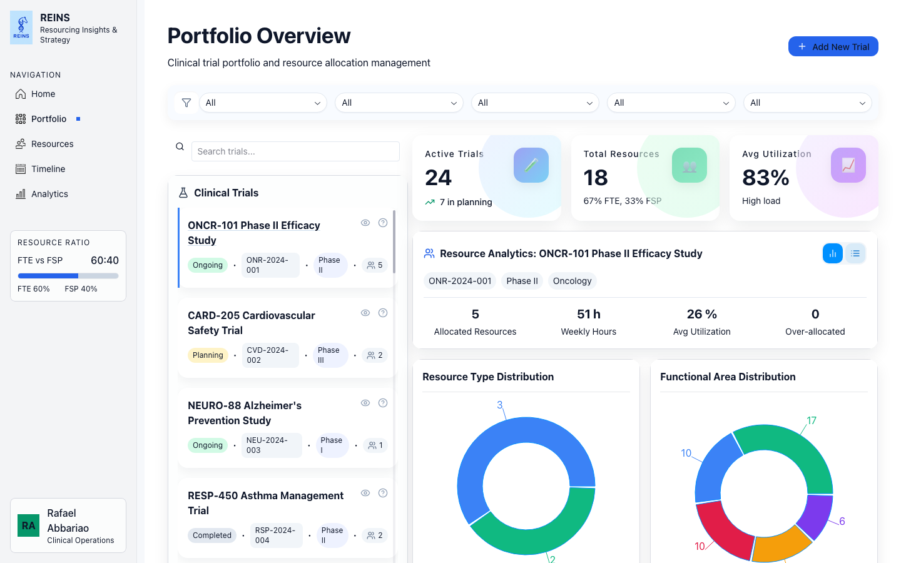
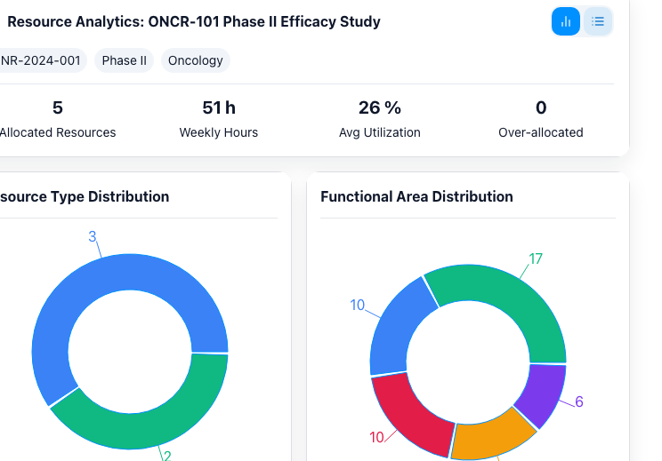
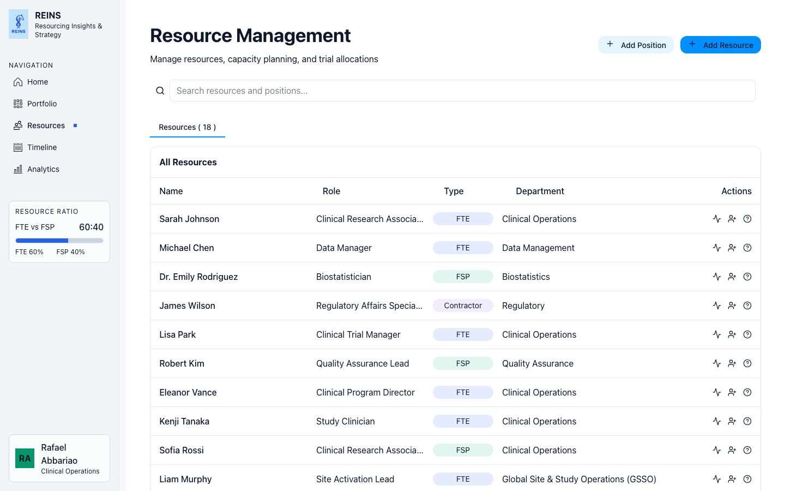
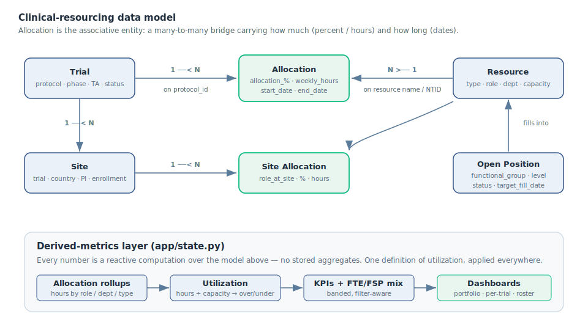

<p align="center">
  
</p>

<h1 align="center">REINS — Resourcing Insights &amp; Strategy</h1>

**A clinical development & operations resourcing dashboard.**
Point REINS at a clinical trial and it shows you the **resourcing demand that
trial generates** — read directly off the trial's own parameters (phase,
therapeutic area, site count, enrollment target, status). How many people, in
which functional areas and departments, at what utilization, and in what
FTE / FSP mix. It does this for one study or across the whole portfolio, then
derives the numbers a resourcing lead actually asks about: **who is over- or
under-allocated, how each study is staffed, and where the pipeline is short.**



---

## Why this exists

In clinical development, the trial calendar is only half the picture — the other
half is **whether you have the right people, in the right functions, allocated at
the right level** to run those trials safely and to quality. And that demand is a
function of the trial itself: a Phase III oncology study with 25 sites and an
enrollment target of 180 needs a very different resourcing footprint than a
Phase I with one site. Yet the answer usually lives scattered across
spreadsheets — one for the study portfolio, one for the resource roster, one for
allocations, one for sites. Nobody can see, at a glance, that a senior CRA is
booked at 130% across three oncology studies while a data manager sits at 20%.

REINS ties resourcing back to the trial parameters that drive it, collapses
those spreadsheets into a single model, and computes the utilization,
allocation, and staffing-mix signals a resourcing lead needs to keep clinical
operations moving without burning people out.

## What it does

| | |
|---|---|
| **Portfolio view** | Filterable trial list (search · status · phase · priority · therapeutic area) with portfolio KPIs: active trials, trials in planning, total resources, and average utilization. |
| **Per-trial staffing** | Select any trial to see its allocated headcount, weekly hours, **functional-area** (role) breakdown, **department** breakdown, and **FTE vs FSP** split — each rendered as a chart and a detail table. |
| **Utilization signal** | Every allocated resource gets a derived utilization %; the app flags **over-allocated** (>100%) and **under-utilized** (<30%) people and bands the portfolio average as Underutilized / Balanced / High load. |
| **Resources view** | Searchable roster of people (name · role · type · department) with a per-person **allocations panel** showing every study they're booked on. |
| **Home / pipeline** | An at-a-glance pipeline snapshot by phase and a therapeutic-area focus board that deep-links into the filtered portfolio. |

<p align="center">
  
  
</p>

## How it works

REINS is a **derived-metrics layer over a small clinical-resourcing data model**.
Six entities — **Trials, Resources, Allocations, Sites, Site Allocations, and
Open Positions** — join into one in-memory model, and every number on screen is a
*reactive computation* over that model rather than a stored figure. Change a
filter and the KPIs, charts, and tables recompute.



The two ideas that make the numbers trustworthy:

- **One utilization definition, applied consistently** — hours ÷ capacity where
  hours exist, allocation-percent otherwise, with a documented fallback. See
  [`docs/METHODOLOGY.md`](docs/METHODOLOGY.md).
- **One join model** across trials ↔ allocations ↔ resources, with the current
  name-based keying (and the planned move to stable NTIDs) spelled out. See
  [`docs/DATA_MODEL.md`](docs/DATA_MODEL.md).

Both are documented in full:

- **Metrics methodology** (utilization, ratios, per-trial rollups, KPI bands):
  [`docs/METHODOLOGY.md`](docs/METHODOLOGY.md)
- **Domain & data model** (the six entities, how they relate, join keys):
  [`docs/DATA_MODEL.md`](docs/DATA_MODEL.md)

## Quickstart

**Prerequisites:** Python ≥ 3.11. Install dependencies:

```bash
python -m venv .venv && source .venv/bin/activate
pip install -r requirements.txt
```

**Run the app:**

```bash
reflex run
```

Then open <http://localhost:3000>. It loads six sample CSVs from `app/data/`
(a synthetic 27-trial / 18-resource portfolio) so you can click through
immediately: **Home → Portfolio → Resources.** Select a trial in Portfolio to
see its staffing breakdown; open a person in Resources to see their allocations.

## Bring your own portfolio

The metrics layer keys off column *names*, not a specific study program. Drop in
your own `Trial.csv`, `Resource.csv`, and `Allocation.csv` (see
[`docs/DATA_MODEL.md`](docs/DATA_MODEL.md) for the expected columns) and the
dashboard recomputes against them. Numeric fields are coerced defensively and
missing columns degrade gracefully rather than erroring.

## Repository layout

```
├── rxconfig.py                       # Reflex app config
├── requirements.txt
├── app/
│   ├── app.py                        # routes + shared sidebar/layout (Home · Portfolio · Resources · Timeline · Analytics)
│   ├── state.py                      # THE METRICS LAYER: filters, KPIs, utilization, per-trial rollups (reactive vars)
│   ├── pages/                        # one module per route
│   ├── components/                   # feature-grouped UI (home · portfolio · resources · sidebar · analytics)
│   └── data/                         # SYNTHETIC sample CSVs (no real people or trials)
├── assets/                           # icons, logo, therapeutic-area imagery, index.css
└── docs/                             # METHODOLOGY.md · DATA_MODEL.md · assets/
```

## Status

**Built:** Home, Portfolio (the full metrics layer + per-trial breakdowns), and
Resources are functional against the sample data. **Roadmap:** the **Timeline**
and **Analytics** pages are scaffolded placeholders, and **capacity planning**
(forward-simulating demand-vs-supply of people the way a study ramps) is the
next major feature — see the limitations section of
[`docs/METHODOLOGY.md`](docs/METHODOLOGY.md).

## Data & privacy

All committed data in `app/data/` is **synthetic and illustrative** — invented
trials, people, and allocations for demonstration. No real patient-level,
personnel, or proprietary trial data is included in this repository.

## Tech

Python · [Reflex](https://reflex.dev) (pure-Python reactive web app) · pandas ·
Plotly. Data is loaded from CSV into reactive state; every KPI, chart, and table
is a computed `@rx.var` over that state.

---

_Built as a portfolio project by [Rafael Carlos Abbariao](https://github.com/rafaelcarlosabbariao)._
